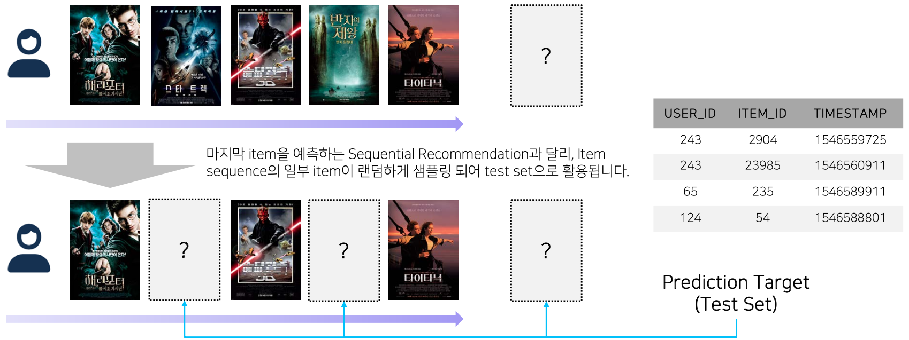
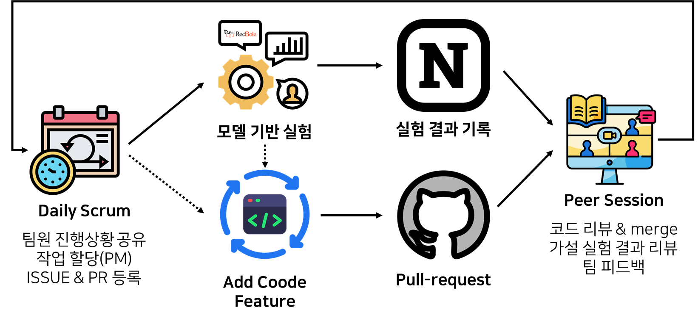
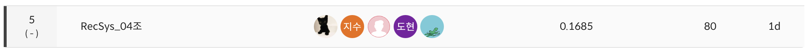
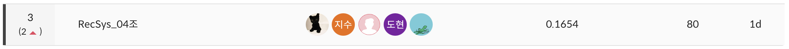

# Part1. [팀] Wrapup Report

---

## 1. 프로젝트 개요

### 1-1. 프로젝트 주제



대회에서는 implicit feedback 기반의 sequential recommendation 시나리오를 바탕으로 **사용자의 time-ordered sequence에서 일부 item이 누락된 (dropout)된 상황을 상정한다**. 이는 sequence를 바탕으로 마지막 item만을 예측하는 sequential recommendation 시나리오와 비교하여, 보다 복잡하며 실제와 비슷한 상황을 가정하고 있다. (여러가지 이유로 아이템 이력이 누락될 수 있다.)

### 1-2. 활용 장비 및 재료

```bash
ai stage server : V100 GPU x 5

python==3.8.5
torch==1.10.0
CUDA==11.0
recbole==1.1.1
wandb==0.15.3
```

### 1-3.  프로젝트 구조 및 사용 데이터셋의 구조도(연관도)
<details>
<summary>프로젝트 구조 및 사용 데이터셋의 구조도(연관도)</summary>
<div markdown="1">
```bash
📦level2_movierecommendation-recsys-04
 ┣ 📂.github
 ┃ ┣ 📂ISSUE_TEMPLATE
 ┃ ┃ ┣ 📜버그-수정.md
 ┃ ┃ ┗ 📜새로운-기능-추가.md
 ┃ ┗ 📜PULL_REQUEST_TEMPLATE.md
 ┣ 📂General
 ┃ ┣ 📂config
 ┃ ┣ 📂model
 ┃ ┣ 📜run.py
 ┃ ┗ 📜utils.py
 ┣ 📂RecBole
 ┃ ┣ 📂config
 ┃ ┃ ┣ 📂general-rec
 ┃ ┃ ┗ 📂sequential-rec
 ┃ ┣ 📜inference.py
 ┃ ┣ 📜setup.py
 ┃ ┣ 📜sweep_config.yaml
 ┃ ┗ 📜train.py
 ┣ 📂Sequence
 ┃ ┣ 📂BERT4Rec
 ┃ ┃ ┣ 📜dataset.py
 ┃ ┃ ┣ 📜inference.py
 ┃ ┃ ┣ 📜models.py
 ┃ ┃ ┣ 📜preprocessing.py
 ┃ ┃ ┣ 📜train.py
 ┃ ┃ ┗ 📜utils.py
 ┃ ┣ 📂SASRec
 ┃ ┃ ┣ 📂utils
 ┃ ┃ ┃ ┣ 📜args.py
 ┃ ┃ ┃ ┣ 📜datasets.py
 ┃ ┃ ┃ ┣ 📜models.py
 ┃ ┃ ┃ ┣ 📜trainers.py
 ┃ ┃ ┃ ┗ 📜utils.py
 ┃ ┃ ┣ 📜run.py
 ┃ ┃ ┗ 📜setup.py
 ┣ 📂ensemble
 ┃ ┣ 📂ensemble_base
 ┃ ┃ ┣ 📜run_voting.py
 ┃ ┃ ┗ 📜voting.py
 ┃ ┣ 📂ensemble_rank
 ┃ ┃ ┗ 📜ensemble.py
 ┃ ┣ 📂ensemble_seq
 ┃ ┃ ┗ 📜ensemble_seq.py
 ┣ 📂valid_sampler
 ┃ ┣ 📜get_sample.py
 ┗ ┗ 📜sampler.py
```
</div>
</details>


## 2. 프로젝트 팀 구성 및 역할

| 이름 | 역할 |
| --- | --- |
| 김수민_T5040 | general model(MultiDAE, EASE) 모델 실험 및 튜닝, ensemble 모듈 구현 |
| 박예림_T5088 | WandB sweep 적용, 모델 실험 및 튜닝, ensemble 구현 |
| 임도현_T5170 | RecBole 템플릿 구축, general recommendation 모델 구현, 모델 실험 및 튜닝 |
| 임우열_T5173 | EDA, sequential model(SASRec, GRU4Rec) 구현 및 ensemble 알고리즘 코드화 |
| 임지수_T5176 | sequential model(BERT4Rec) 구현 및 실험, 인퍼런스 모듈 개선 |

## 3. 프로젝트 수행 절차 및 방법



## 4. 프로젝트 수행 결과

### 4-1. 모델 분석

| 모델 유형 | 모델 이름 | Recall@10 |
| --- | --- | --- |
| General | HighOrder EASE | 0.1614 |
|  | EASE | 0.1600 |
|  | ADMM-SLIM | 0.1551 |
|  | Multi-DAE | 0.1405 |
|  | RecVAE | 0.1386 |
|  | Multi-VAE | 0.1349 |
|  | ItemKNN | 0.1065 |
| Sequential | BERT4Rec | 0.0978 |
|  | SASRec | 0.0944 |
|  | GRU4Rec | 0.0684 |
- 아이템 정보를 함께 사용하는 모델의 경우 아이템 정보에 대해 전처리가 필요했다. 우리는 이러한 전처리에 시간을 투자하기보다 유저-아이템간의 상호작용만을 필요로 하는 auto-encoder, sequential 모델을 사용하여 다양한 실험을 시도하기로 결정했다.
- Auto-encoder 계열 모델들의 성능이 좋은 이유는 encoder가 잠재 요인을 추출하는 과정에서 유의미한 행동 특성을 보이지 않는 유저를 자체적으로 필터링해주기 때문으로 판단했다.
- 반대로 **sequential 모델들의 성능이 비교적 떨어지는 이유**는 대회의 task 가 일반적인 sequential task와 다르게 random masking 된 부분을 예측해야 하므로, sequentiality 를 반영하는 것의 중요성이 떨어지기 때문으로 판단했다.
- 그럼에도 **sequential 모델들을 반영해 앙상블을 진행한 이유**는 두 계열의 모델들의 예측 양상이 상이하고, random masking task 에서도 절단된 sequentiality 가 존재하기 때문에, 예측의 diversity 를 반영하기 위함이다.

### 4-2. 앙상블 성능

- Weighted rank soft voting 방식과 hard voting (seq column), soft voting 방식을 적용했을 때 성능 개선에 실패했다. soft voting 방식은 가중치를 적절히 조절하는 것이 매우 중요한데, 대회 종료가 임박했을 때 soft voting 방식을 구현하여 적절한 가중치를 찾는 실험을 많이 하지 못했기 때문이라고 생각했다.
- 따라서 최대한 많은 모델의 아웃풋을 반영하는 hard voting 방식을 선택했다. 그 결과 상위권 팀 중 private 리더보드 상의 가장 낮은 성능 감소를 보이며 강건한 모델을 구축했다.



public score



private score

## 5. 자체 평가 의견

- Github의 Issue & Pull Request 를 기반으로 가설과 실험 과정을 기록하고 코드 리뷰를 진행하였고, 팀의 [Git convention](https://github.com/boostcampaitech5/level2_movierecommendation-recsys-04)을 철저하게 지켜 보다 체계적이고 기록이 가능한 대회를 진행하였다.
- PM을 번갈아 진행하면서 인수인계와 프로젝트 관리 역할을 모두 잘 수행하였다.
- 논문 스터디를 통해 모델에 대한 이론적 학습을 진행하고, 테스크에 적합한 모델을 선별하여 적용하였다.
- 개인 작업 및 공부한 내용에 대해서 **[Docs](https://www.notion.so/e7056f9062d74324b708e035328aa4cb?pvs=21)** 형태로 작성하여 팀원들과 활발하게 공유하였다.
- 다양한 [앙상블 전략](https://www.notion.so/Docs-567c34988ab4488394c6178eecc53b0f?pvs=21)을 고안해냈고, 적절한 전략을 선택하여 결과적으로 입력 데이터의 변화에 민감하지 않은 강건한 결과를 만들어냈다.